# EventCloud (Akwaaba) — Completed Stage Documentation


A cloud-native event management platform built on AWS that enables event organisers to create, manage, and monitor events — while attendees can register, receive digital QR tickets, and check in securely.

---

## Table of Contents

- [Getting Started](#getting-started)
- [Tools Required](#tools-required)
- [Installation](#installation)
- [Project Structure](#project-structure)
- [Folder Description](#folder-description)
- [Architecture](#architecture)
- [AWS Services](#aws-services)
- [Core Features](#core-features)
- [Screenshots](#screenshots)
- [API Overview](#api-overview)
- [Development](#development)
- [Running the App](#running-the-app)
- [Deployment](#deployment)
- [Known Gaps](#known-gaps)
- [Roadmap](#roadmap)
- [Future Enhancements](#future-enhancements)
- [Authors](#authors)
- [License](#license)
- [Acknowledgments](#acknowledgments)

---

## Getting Started

The project has 6 active branches — one per team role or feature area — with all changes merged into `develop` before being released to `main`.

- `main` — stable release branch
- `develop` — active development branch
- Feature branches — one per team member or feature

---

## Tools Required

To work with this project locally you will need:

- Node.js and npm — for the React frontend
- Python 3.x — for Lambda functions
- AWS CLI — to interact with AWS services
- AWS SAM CLI — for deploying serverless infrastructure
- An AWS account with appropriate IAM permissions
- A code editor (VS Code recommended)
- Git — to clone and manage the repository

---

## Installation

Clone the repository:

```bash
git clone https://github.com/Wild-Technological-Services/eventcloud.git
```

Navigate into the project:

```bash
cd eventcloud
```

Install frontend dependencies:

```bash
cd Frontend
npm install
```

Set up your AWS credentials:

```bash
aws configure
```

Deploy the infrastructure (from the Infrastructure folder):

```bash
cd ../Infrastructure
sam build
sam deploy --guided
```

---

## Project Structure

```
eventcloud/
│
├── Backend/               # Python Lambda functions and API logic
├── Docs/                  # Project documentation and wireframes
├── Frontend/              # React web application (Akwaaba)
├── Infrastructure/        # AWS SAM and CloudFormation templates
├── .gitignore             # Files excluded from version control
├── Devops.README.md       # DevOps-specific setup and deployment notes
└── README.md              # Main project documentation (this file)
```

---

## Folder Description

**Backend/**
Contains all Python-based AWS Lambda functions that power the platform's business logic, including:
- Auth Lambda — handles user registration, login, logout, email verification, and JWT token management
- Events Lambda — handles event creation, editing, publishing, unpublishing, deletion, and image uploads
- Registration Lambda — manages attendee registrations, seat capacity, and cancellations
- Ticket Lambda — generates QR code tickets, handles validation, check-in, and digital ticket downloads

Each Lambda connects to DynamoDB for data storage and integrates with Amazon Cognito for authentication.

**Frontend/**
Contains the React + JavaScript web application. This is what attendees and organisers interact with in the browser. Includes:
- Authentication pages (login, register, email verification)
- Public event browsing and registration flow
- Event manager portal (events CRUD, participants list, dashboard)
- Digital ticket display
- Attendee check-in support
- Mock fallback mode for local development without a deployed API

**Infrastructure/**
Contains the Infrastructure as Code (IaC) using AWS SAM and nested AWS CloudFormation stacks. Defines and provisions all AWS resources including:
- API Gateway routes and Lambda integrations
- DynamoDB table schemas and Global Secondary Indexes
- Cognito User Pool with role groups (Admin, Organiser, Attendee)
- S3 buckets for frontend hosting, event images, and ticket artifacts
- IAM roles and least-privilege permissions
- CloudFront distribution for frontend delivery

**Docs/**
Contains project documentation, architecture diagrams, API contracts, database design, security reviews, and planning materials.

**Devops.README.md**
A separate README for the DevOps and Cloud Architect team member, covering CI/CD pipeline setup, IAM configuration, branch strategy, and deployment instructions.

---

## Architecture

The platform follows a serverless architecture on AWS, designed for scalability, reliability, and cost efficiency.

```
Organisers & Attendees
        |
        ▼
   CloudFront (CDN — delivers the React frontend globally)
        |
        ▼
  React SPA (Akwaaba — hosted on Amazon S3)
        |
        ▼
   API Gateway HTTP API
        |
        ▼
  Cognito JWT Authorizer
        |
        ▼
  AWS Lambda Functions (Python 3.12)
  ┌───────────┬───────────┬──────────────┬─────────────┐
  │   Auth    │  Events   │Registration  │  Tickets    │
  │  Lambda   │  Lambda   │   Lambda     │  Lambda     │
  └─────┬─────┴─────┬─────┴──────┬───────┴──────┬──────┘
        |           |            |              |
        ▼           ▼            ▼              ▼
              Amazon DynamoDB (NoSQL)
                       |
           ┌───────────┴───────────┐
           ▼                       ▼
      Amazon SES               Amazon SNS
      (Email — planned)        (SMS — planned)
                       |
                       ▼
                  Amazon S3
         (Event images & ticket artifacts)
```

> Note: SES and SNS are provisioned and IAM-permitted but notification delivery is not yet wired in application code.

---

## AWS Services

| Service | Purpose |
|---------|---------|
| Amazon Cognito | User authentication and role-based access control (Admin / Organiser / Attendee) |
| API Gateway | REST API management and request routing |
| AWS Lambda | Serverless business logic — Python 3.12 |
| Amazon DynamoDB | NoSQL database for events, users, registrations, and tickets |
| Amazon S3 | Storage for event images and QR code ticket artifacts |
| Amazon CloudFront | CDN — fast global delivery of the frontend SPA |
| Amazon SES | Email notifications — provisioned, delivery not yet wired |
| Amazon SNS | SMS notifications — provisioned, delivery not yet wired |
| Amazon CloudWatch | Logging and monitoring |
| AWS X-Ray | Distributed tracing on all Lambda functions |
| IAM | Roles and least-privilege permissions across all services |
| AWS SAM / CloudFormation | Infrastructure as Code — reproducible deployments |

---

## Core Features

### Authentication
- User registration and login
- Email verification and resend confirmation
- Password recovery (forgot password, confirm reset)
- Token refresh on session expiry
- Role-based access control: Admin, Organiser, Attendee
- Cognito JWT as the default API authorizer

### Event Management
- Create, list, retrieve, update (PATCH), and soft-delete events
- Publish and unpublish events with precondition checks
- Event image upload via presigned S3 URL
- Public event browsing (published public events only)
- Organiser's own event management including drafts

### Registration
- Register for public events with seat capacity tracking
- Cancel registration
- View registrations by event or by user

### Ticketing
- QR code ticket issued automatically on registration
- Ticket retrieval and download
- Ticket validation
- Check-in at the event

### Attendee-Facing Event Access
- **Public Events** — attendees can browse and register directly
- **By Invitation Only** — invited attendees must confirm availability before a ticket is issued

### Organiser Dashboard
- Event overview and statistics (dashboard connected to mock data at this stage)
- Participants and registration list views

---

## Screenshots

### Authentication & Onboarding

**Landing Page**

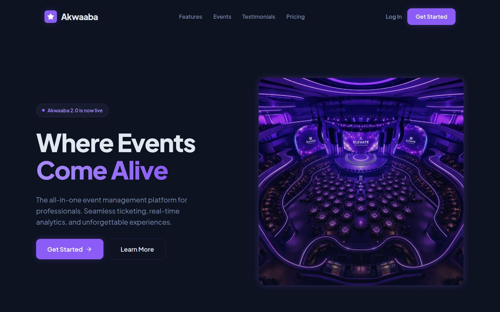

**Login**

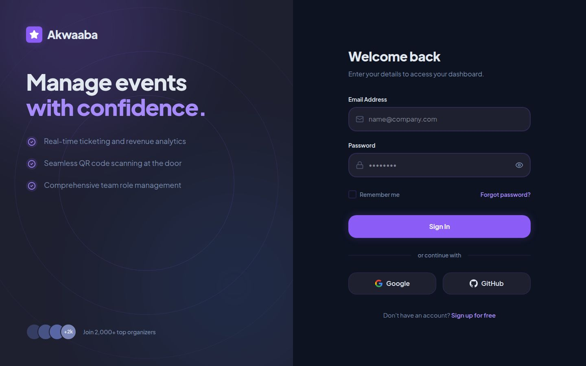

---

### Organiser Portal

**Dashboard**

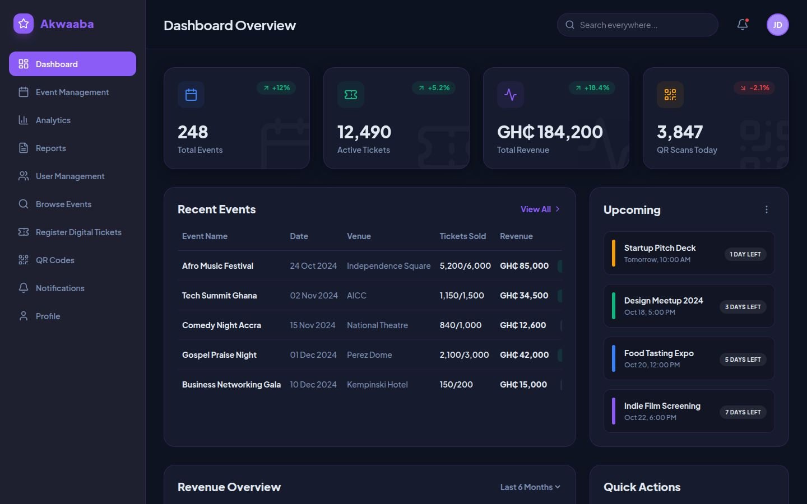

**Event Management**

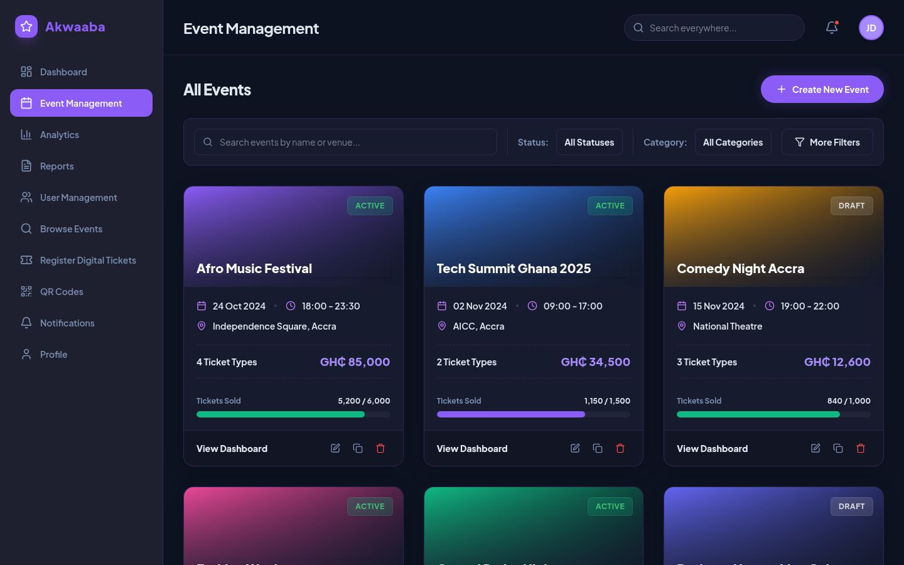

**Analytics**

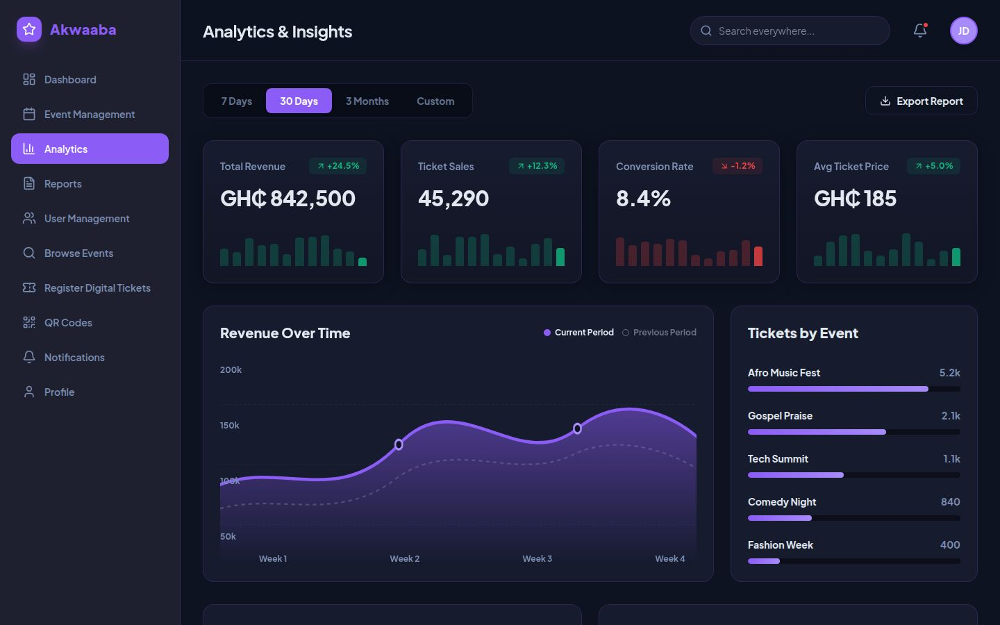

**Reports**

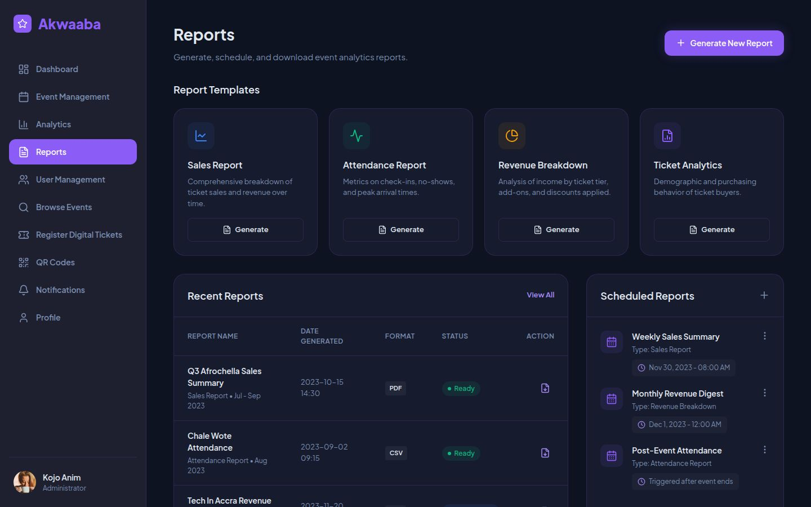

**User Management**

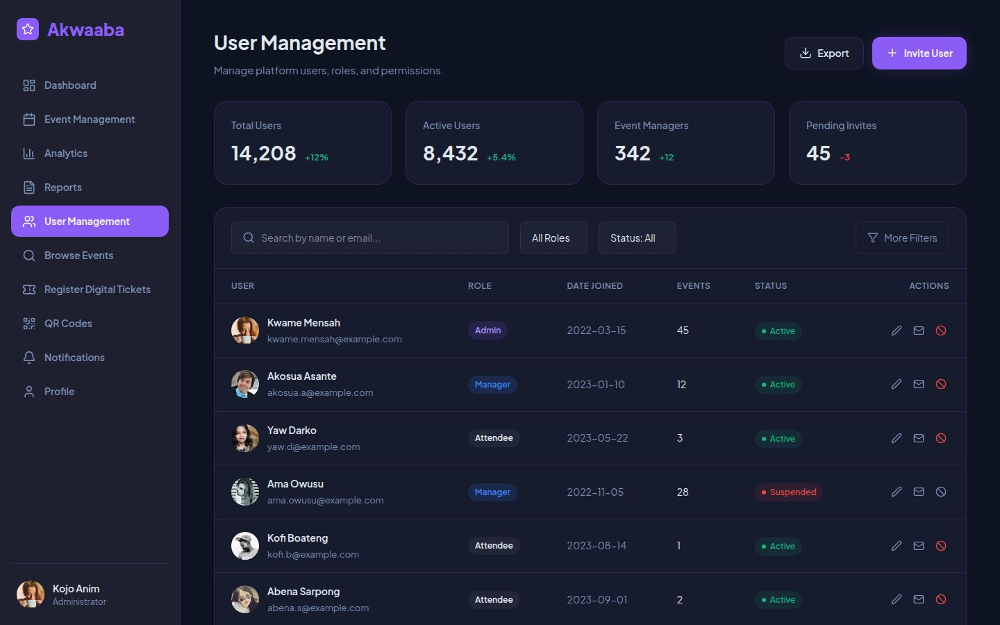

**Notifications**

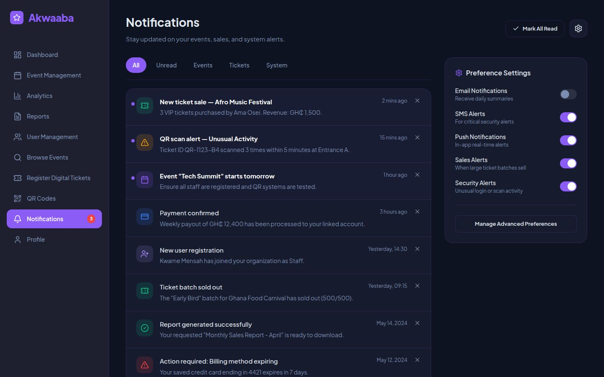

**Profile**

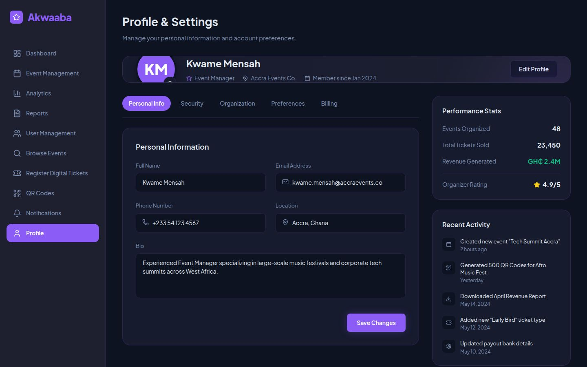

---

### Attendee Experience

**Browse Events**

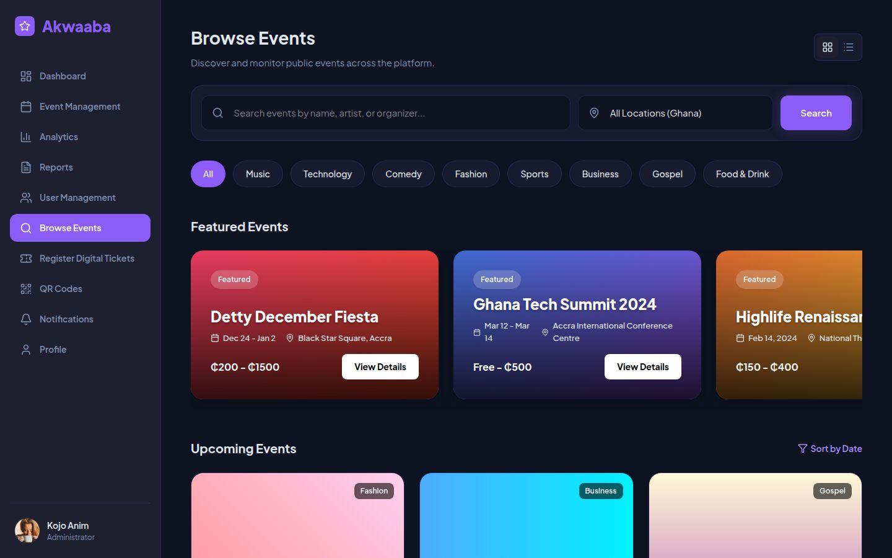

**Register & Tickets**

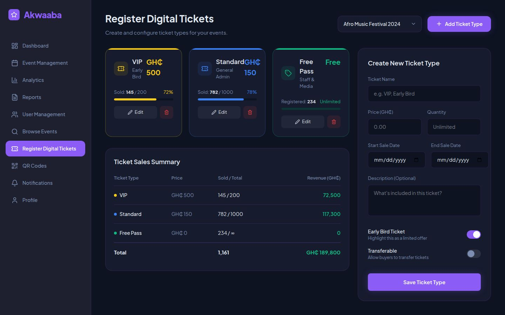

**QR Code Tickets**

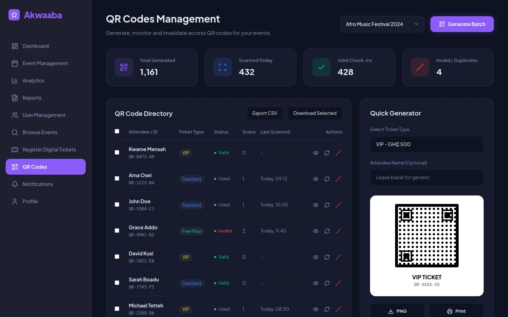

---

## API Overview

### Public Routes (No Authentication Required)

| Method | Path | Purpose |
|--------|------|---------|
| GET | `/health` | Health check |
| POST | `/auth/register` | Register a new user |
| POST | `/auth/login` | Login and receive tokens |
| POST | `/auth/logout` | Logout |
| POST | `/auth/verify-email` | Verify email address |
| POST | `/auth/resend-confirmation` | Resend verification email |
| POST | `/auth/refresh` | Refresh session token |
| POST | `/auth/forgot-password` | Request password reset |
| POST | `/auth/confirm-forgot-password` | Confirm new password |
| GET | `/events` | Browse published public events |
| GET | `/events/{eventId}` | View a specific event |

### Authenticated Routes (Cognito JWT Required)

| Method | Path | Purpose |
|--------|------|---------|
| GET | `/me/events` | List organiser's own events (including drafts) |
| POST | `/events` | Create an event |
| PATCH | `/events/{eventId}` | Update an event |
| DELETE | `/events/{eventId}` | Soft-delete an event |
| POST | `/events/{eventId}/publish` | Publish an event |
| POST | `/events/{eventId}/unpublish` | Unpublish an event |
| POST | `/events/{eventId}/image` | Upload event banner image |
| POST | `/events/{eventId}/registrations` | Register for an event |
| GET | `/events/{eventId}/registrations` | List registrations for an event |
| DELETE | `/events/{eventId}/registrations/{id}` | Cancel a registration |
| GET | `/me/registrations` | View current user's registrations |
| GET | `/tickets/{ticketId}` | Retrieve a ticket |
| GET | `/tickets/{ticketId}/download` | Download a ticket |
| GET | `/tickets/{ticketId}/validate` | Validate a ticket |
| POST | `/tickets/check-in` | Check in an attendee |
| GET | `/events/{eventId}/attendees` | List event attendees |

---

## Development

### Team Roles

| Role | Responsibilities |
|------|----------------|
| Cloud Architect | AWS infrastructure, IAM, CI/CD pipeline, branch strategy, deployment |
| Backend Developer(s) | Lambda functions, API logic, DynamoDB integration |
| Frontend Developer(s) | React web app, UI pages, and component design |
| QA Engineer | Testing and documentation |

### Workflow

The team follows a feature-branch Git workflow:

1. Create a feature branch from `develop`
2. Implement the feature
3. Commit with clear, descriptive messages
4. Open a Pull Request
5. Team code review
6. Merge into `develop`
7. Tested features are released from `develop` to `main`

---

## Running the App

### Frontend (local development)

```bash
cd Frontend
cp .env.example .env    # Set VITE_API_BASE_URL to your API Gateway endpoint
npm run dev
```

The app will run at `http://localhost:3000`

> If `VITE_API_BASE_URL` is not set, the app falls back to local mock data automatically.

### Backend (local Lambda testing)

```bash
cd Infrastructure
sam build
sam local start-api
```

This spins up a local version of API Gateway and your Lambda functions for testing.

---

## Deployment

The platform is deployed fully on AWS using SAM and CloudFormation.

1. Ensure AWS CLI is configured:
```bash
aws configure
```

2. Build the SAM application:
```bash
sam build
```

3. Deploy to AWS:
```bash
sam deploy --guided
```

- The React frontend build is uploaded to S3 and served via CloudFront
- API Gateway, Lambda functions, and DynamoDB tables are provisioned automatically from the Infrastructure configuration

**Environments:** Development → Staging → Production, each configured via `Infrastructure/sam/env/*.json`

---

## Known Gaps

The following features are planned but not yet fully implemented:

| Area | Status |
|------|--------|
| OTP / Passwordless login | Not implemented — Cognito CUSTOM_AUTH not configured |
| MFA | Cognito MFA not enabled |
| Waiting list | Not modelled in database or backend |
| Notification delivery | DynamoDB table exists; Lambda handlers and SES/SNS senders not wired |
| Admin APIs | `/admin/users`, `/admin/events`, `/admin/metrics` not implemented |
| Analytics | Frontend uses hardcoded dummy data — not connected to live API |
| CI/CD pipeline | Deployments are manual — no GitHub Actions pipeline in-repo |
| Payments | Future enhancement |

---

## Roadmap

| Week | Focus |
|------|-------|
| Week 1 ✅ | Project setup — repository, branches, AWS account, IAM, base CloudFormation, Cognito, auth Lambda, core frontend pages |
| Week 2 ✅ | Authentication (Cognito) and Event Management (Lambda + DynamoDB) |
| Week 3 ✅ | Registration system and Ticketing (QR codes, validation, check-in) |
| Week 4 ✅ | Organiser dashboard, participant views, and attendee event pages |
| Week 5 ✅ | Integration, testing, bug fixes |
| Week 6 ✅ | Final deployment, documentation, and demo |

---

## Future Enhancements

- Online payments integration
- AI-powered event recommendations
- Google Calendar and iCal integration
- Live streaming support
- Mobile push notifications
- Multi-language support
- React Native mobile application

---

## Authors

| Role | Contribution |
|------|-------------|
| Cloud Architect | AWS infrastructure, IAM, CloudFormation, Cognito, and deployment |
| Backend Developer(s) | Python Lambda functions, API logic, and DynamoDB integration |
| Frontend Developer(s) | React web app, portal pages, and attendee event pages |
| QA Engineer | Testing and documentation |

See the full list of contributors on the Contributors page.

---

## License

This project is licensed under the MIT License — see the LICENSE file for details.

---

## Acknowledgments

- AWS Documentation — official AWS service guides
- AWS SAM Documentation — serverless deployment reference
- All team members who contributed across cloud, backend, frontend, and QA
